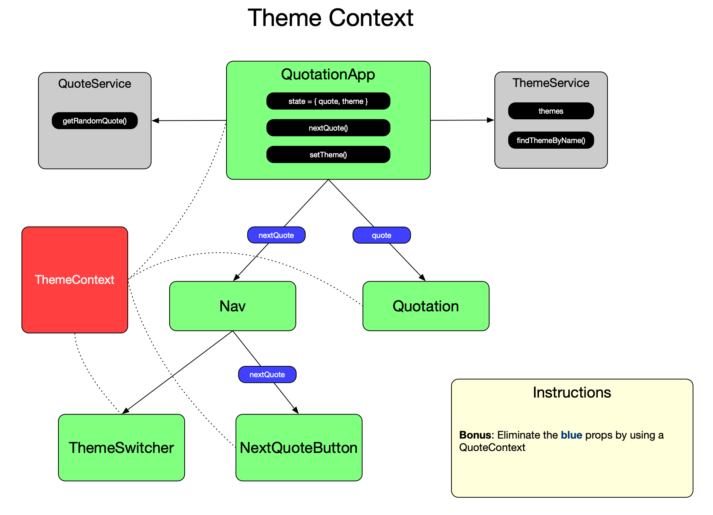

# React Context API Lab - Quotes on Software Engineering

## Introduction

This repo contains the starter code for the React Context API lab. The starter code contains a complete working app that shows some random quotes from Software Engineering books.

## Instructions

1. Clone this repository
2. Create a branch
3. refactor the code to use the React Context API so eliminate the `theme` and `setTheme` props.

NOTE: The `ThemeContext` has been provided for you in the file `src/quotation/ThemeContext.js`.

To subscribe to the Context, you can use either the standard `<Context.Consumer>` or if you have learned about React `hooks` you can use `React.useContext`.

## Bonus

As a bonus try creating a `QuoteContext` and remove the `quote` and `nextQuote` props.

## Visualization

To help you visualize what is going on, you will start with this structure:

and refactor it to this structure:

**NOTE: the `red` props have been removed because the child components can now get them from the `Context`.**

